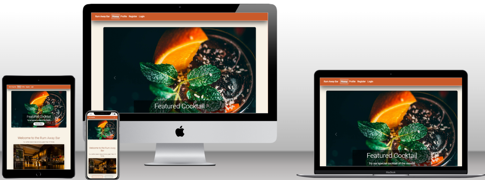
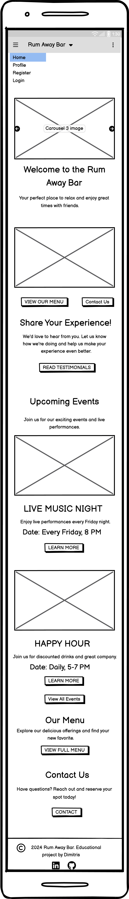
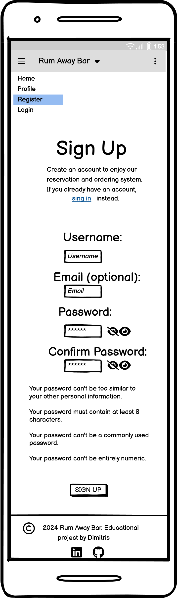
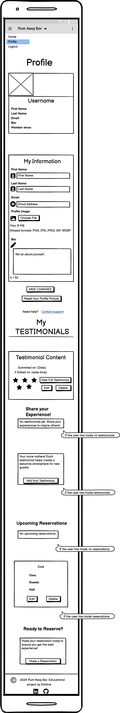
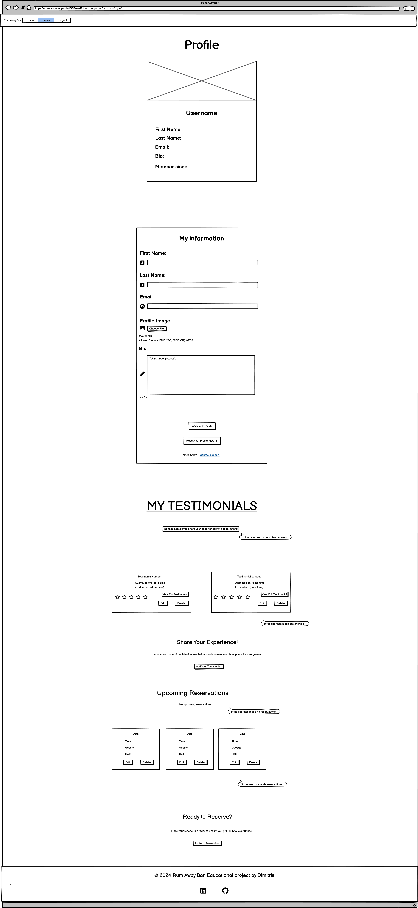
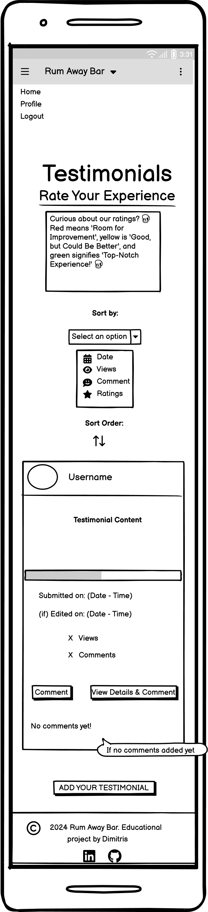

<h1 align="center">🥃 <a href="https://rum-away-testp4-d410f580ea18.herokuapp.com/">Rum Away Bar</a> 🥃</h1>

## The purpose of this project is a web based application designed to streamline the operations of a bar called **Rum Away Bar**, providing both customers and administrator with a platform to manage reservations, events and iteractions. It features a user friendly interface for users to browse events, make reservations and view testimonials while also offering an admin panel to control various aspects.

### Key features: 
 - Authentication & Authorization: Secure user authentication and authorization built using Django allauth, allowing users to register, login and manage their accounts.
 - Reservation System: Users can create and manage their reservations while preventing them on multiple bookings for the same date.
 - Event Management: Admin has full control over event creation and management via the admin panel, including the ability to create - edit - delete events.
 - User Profiles & API Integration: API endpoints allow for dynamic content handling, such as profile management and profile images stored secured using Cloudinary.
 - Media management: Integration with Cloudinary allows users and admin to upload, store, manage images efficiently.
 - Testimonials Section: A dedicated area for users to view and interact with testimonials from other users.
 - The platform is built using Django and PostgreSQL.

## [User Stories](https://github.com/users/Dimitris112/projects/5/views/1) 

### 1. User Registration
- **As a** new user, **I want** an easy account setup **to** enjoy personalized features.
- **Acceptance**: Users enter email, username, and password. Errors show for taken usernames/emails.

### 2. User Profile Edit
- **As a** user, **I want** to update my profile **to** keep my details current.
- **Acceptance**: Users change name, email, or password. Changes save instantly.

### 3. Comment on Testimonials
- **As a** registered user, **I want** to comment on testimonials **to** share my thoughts.
- **Acceptance**: Users comment on testimonials, visible after submission. Errors appear for guideline violations.

### 4. Filter Testimonials
- **As a** user, **I want** to filter testimonials **to** find what interests me.
- **Acceptance**: Users filter testimonials by category, with options to reset filters.

### 5. Admin Dashboard Access
- **As an** admin, **I want** dashboard access **to** manage testimonials efficiently.
- **Acceptance**: Admins see user stats, testimonial counts, and can manage testimonials and accounts.

### 6. User Responsive Design
- **As a** user, **I want** a device-friendly website **for** a smooth experience on any device.
- **Acceptance**: The layout adjusts for mobile, keeping navigation user-friendly.

### 7. Admin Testimonial Analytics
- **As an** admin, **I want** to see testimonial analytics **to** gauge engagement and popularity.
- **Acceptance**: An analytics page shows total views and comments for each testimonial.

### 8. User Comment Character Limit
- **As a** user, **I want** a comment character limit **to** keep discussions concise.
- **Acceptance**: A 500-character limit is shown, with warnings as it approaches. A counter tracks remaining characters.

### 9. User Testimonial Details
- **As a** user, **I want** detailed testimonial info **to** better understand the context.
- **Acceptance**: Clicking a testimonial leads to a detail page with full text, user info, and comments.

### 10. User Account Deletion
- **As a** user, **I want** to delete my account **to** remove my data if I no longer want the service.
- **Acceptance**: A deletion option in settings, confirming without prompts for immediate removal.

### 11. User Edit Comment
- **As a** user, **I want** to edit my comments **to** correct mistakes.
- **Acceptance**: An "Edit" button allows modifications, with changes reflected instantly.

### 12. User Display Comments
- **As a** user, **I want** to see all comments on a testimonial detail page **to** view community feedback.
- **Acceptance**: The detail page shows all comments, sorted by most recent.

### 13. User Profile Customization
- **As a** user, **I want** to customize my profile **to** express my personality.
- **Acceptance**: Users upload a profile picture, change display name, and add a bio, with instant saving.

## User Experience

### Typography & Color scheme

The project uses Roboto and Lato fonts for a clean and modern design. The color scheme consists of:

    Primary Color: #c95a2a (warm orange) 🟠
    Secondary Color: #6d4c41 (rich brown) 🟤
    Background: #f8f2e6 (light beige) 🟡

This palette creates an inviting and cozy atmosphere, fitting for a bar setting, with subtle highlights and shadows adding depth to the design.

### Agile Planning

This project was developed using agile methodologies over a span of approximately four weeks. The development process included the use of various labels such as "documentation" - "good first issue" - "enhancement" to organize tasks and streamline progress. An MVP (Minimum Viable Product) milestone was established to focus on delivering essential features. Each user story is accompanied by a comprehensive set of acceptance criteria, ensuring that all functionalities, including those for the 404 and 505 error pages, are well-defined and meet completion standards. For more details, you can view the kanban board [here](https://github.com/users/Dimitris112/projects/5).

    

### Features

#### Navigation

The navigation bar displays the **Rum Away Bar text**, which serves as an index anchor. The **Home** - **Profile** links, for non logged in users also the **Register** - **Login**.
To logged in users Register and Login links are gone and in their place it's the **Logout**.

- Clicking the *Rum Away Bar* and *Home* takes the users back to the homepage (index.html).
- Clicking the *Profile* takes the users to the profile page (profile.html).
- Clicking the *Register* takes the users to the register page (signup.html).
- Clicking the *Login* takes the users to the login page (login.html).
- Clicking the *Logout* takes the users to the logout page (logout.html).

### Wireframes

The wireframes have been designed for both PC and mobile screens to provide a visual representation of each page's layout and functionality.

<table style="width: 100%; border-collapse: collapse;">
    <tr>
        <th style="text-align: center;">Home</th>
        <th style="text-align: center;">Sign Up</th>
        <th style="text-align: center;">Sign In</th>
        <th style="text-align: center;">Profile</th>
        <th style="text-align: center;">Testimonials</th>
    </tr>
    <tr>
        <td style="text-align: center; vertical-align: top;">
            

                
                
            

        </td>
        <td style="text-align: center; vertical-align: top;">
            

                
                
            

        </td>
        <td style="text-align: center; vertical-align: top;">
            

                
                
            

        </td>
        <td style="text-align: center; vertical-align: top;">
            

                
                
            

        </td>
        <td style="text-align: center; vertical-align: top;">
            

                
                
            

        </td>
    </tr>
</table>

## Technology Stack

<table>
  <tr>
    <td valign="top">
      <h3>Technology Used</h3>
      <table>
        <tr>
          <td><strong>Backend</strong></td>
          <td style="text-align:right;">Django 5.1.1 <code>Django==5.1.1</code></td>
        </tr>
        <tr>
          <td><strong>API</strong></td>
          <td style="text-align:right;">Django REST Framework <code>djangorestframework==3.15.2</code></td>
        </tr>
        <tr>
          <td><strong>Database</strong></td>
          <td style="text-align:right;">PostgreSQL <code>psycopg2==2.9.9</code></td>
        </tr>
        <tr>
          <td><strong>Authentication</strong></td>
          <td style="text-align:right;">Django Allauth <code>django-allauth==64.2.1</code></td>
        </tr>
        <tr>
          <td><strong>Frontend</strong></td>
          <td style="text-align:right;">JavaScript, JSON, HTML5, CSS3</td>
        </tr>
        <tr>
          <td><strong>Styling</strong></td>
          <td style="text-align:right;">Crispy Forms + Bootstrap 5 <code>crispy-bootstrap5==2024.2</code></td>
        </tr>
        <tr>
          <td><strong>Media Storage</strong></td>
          <td style="text-align:right;">Cloudinary <code>cloudinary==1.41.0</code></td>
        </tr>
        <tr>
          <td><strong>Static Files</strong></td>
          <td style="text-align:right;">Whitenoise <code>whitenoise==6.7.0</code></td>
        </tr>
        <tr>
          <td><strong>Server</strong></td>
          <td style="text-align:right;">Gunicorn <code>gunicorn==23.0.0</code></td>
        </tr>
        <tr>
          <td><strong>Image Handling</strong></td>
          <td style="text-align:right;">Pillow <code>pillow==10.4.0</code></td>
        </tr>
      </table>
    </td>
    <td valign="top" style="padding-left: 20px;">
      <h3>Other Dependencies</h3>
      <ul style="list-style-type: none; padding-left: 0;">
        <li><code>asgiref==3.8.1</code></li>
        <li><code>dj-database-url==2.2.0</code></li>
        <li><code>dj3-cloudinary-storage==0.0.6</code></li>
        <li><code>django-crispy-forms==2.3</code></li>
        <li><code>django-summernote==0.8.20.0</code></li>
        <li><code>oauthlib==3.2.2</code></li>
        <li><code>PyJWT==2.9.0</code></li>
        <li><code>python3-openid==3.2.0</code></li>
        <li><code>requests-oauthlib==2.0.0</code></li>
        <li><code>sqlparse==0.5.1</code></li>
        <li><code>urllib3==1.26.20</code></li>
      </ul>
    </td>
  </tr>
</table>

## Credits

🎓 **𝕽𝖔𝖍𝖎𝖙** - **Code Institute Mentor** 

💡 **[Gareth's readme](https://github.com/Gareth-McGirr/Portfolio-Project-4-SizzleAndSteak)** as inspiration mine.

[ChatGPT 4o mini](https://openai.com/chatgpt/) / [Codeium](https://codeium.com/) / [Stack Overflow](https://stackoverflow.com/) for adjustments and bug fixing aid.

The main idea for this project was obtained by the [Django Blog](https://www.youtube.com/watch?v=YH--VobIA8c) walkthrough project of the [Code Institute course](https://codeinstitute.net/global/).

#### Media

All photos used in the project were taken from [Pexels](https://www.pexels.com/) / [Unsplash](https://unsplash.com/) / [Freepik](https://www.freepik.com/).
