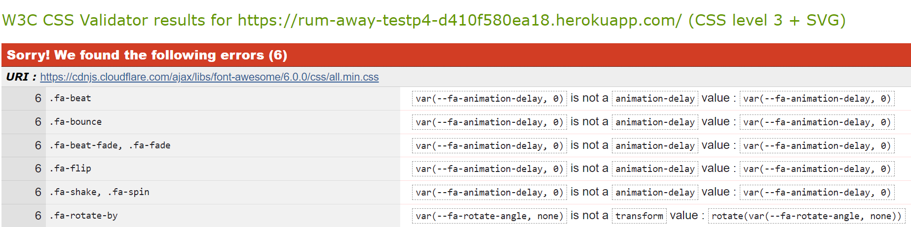
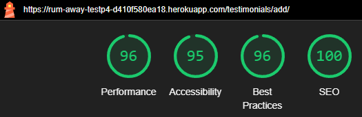
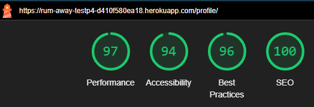
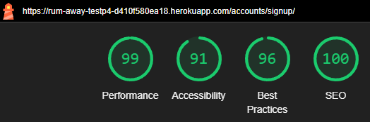
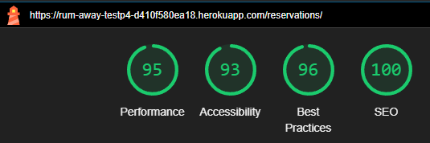

# Testing Documentation

[Automated Testing](#automated-testing)

- [Lighthouse Scores](#lighthouse-scores)
- [Running Tests](#running-tests)

[Manual Testing](#manual-testing)

## Automated Testing

- **HTML Validation**: Used the [W3C HTML Validator](https://validator.w3.org/) which returned the following results:
  <div style="text-align: center; margin: 10px 0;">
      
  </div>

- **CSS Validation**: Used the [W3C CSS Validator](https://jigsaw.w3.org/css-validator/) which returned the following results:
  <div style="text-align: center; margin: 10px 0;">
      
  </div>

- **JavaScript Validation**: Used [JSHint](https://jshint.com/) to validate JavaScript code. The validation process returned a clean report compliant with ES6+ standards.

### Lighthouse scores

Lighthouse metrics were scored on Incognito Chrome

<div style="text-align: center;">
    
    
    
    
    
    
    
    
    
    
    
    
</div>

- **Jest**: A JavaScript testing framework used for unit and integration tests.
- **Django Test Framework**: The built-in testing framework for Django applications.

### Running Tests

Make sure to include the correct versions for both JavaScript & Django testing.

JavaScript -> `package.json`

Django -> `requirements.txt`

On the terminal write the commands below:

```bash
# For javascript
npm test

# For Django
python3 manage.py test
```

- **JavaScript Testing**: The JavaScript tests returned the following results:
  <div style="text-align: center; margin: 10px 0;">
      
  </div>

- **Django Testing**: The Django tests for the application returned the following results:

<table style="width: 100%; margin: 20px 0; border-collapse: collapse; text-align: center;">
    <tr>
        <td>
            <h2>Bar App Tests</h2>
            
        </td>
        <td>
            <h2>Testimonial App Tests</h2>
            
        </td>
    </tr>
</table>

## Manual Testing

<details>
    <summary><strong>Navigation & Footer</strong></summary>
    <table>
        <thead>
            <tr>
                <th>Test Name</th>
                <th>Steps</th>
                <th>Expected Result</th>
                <th>Actual Result</th>
                <th>Pass/Fail</th>
            </tr>
        </thead>
        <tbody>
            <tr>
                <td>Home Navigation</td>
                <td>
                    1. Click on the <em>Rum Away Bar</em> text.<br>
                    2. Click on the <em>Home</em> link.
                </td>
                <td>User is redirected to the homepage (index.html).</td>
                <td>[Same as Expected]</td>
                <td>&#10003;</td>
            </tr>
            <tr>
                <td>Profile Navigation</td>
                <td>
                    1. Click on the <em>Profile</em> link.
                </td>
                <td>User is redirected to the profile page (profile.html).</td>
                <td>[Same as Expected]</td>
                <td>&#10003;</td>
            </tr>
            <tr>
                <td>Register Navigation</td>
                <td>
                    1. Click on the <em>Register</em> link.
                </td>
                <td>User is redirected to the register page (signup.html).</td>
                <td>[Same as Expected]</td>
                <td>&#10003;</td>
            </tr>
            <tr>
                <td>Login Navigation</td>
                <td>
                    1. Click on the <em>Login</em> link.
                </td>
                <td>User is redirected to the login page (login.html).</td>
                <td>[Same as Expected]</td>
                <td>&#10003;</td>
            </tr>
            <tr>
                <td>Logout Navigation</td>
                <td>
                    1. Click on the <em>Logout</em> link.
                </td>
                <td>User is redirected to the logout page (logout.html).</td>
                <td>[Same as Expected]</td>
                <td>&#10003;</td>
            </tr>
            <tr>
                <td>Footer Links</td>
                <td>
                    1. Click on the <em>My LinkedIn</em> link.<br>
                    2. Click on the <em>My GitHub</em> link.
                </td>
                <td>User is redirected to LinkedIn and GitHub pages in new tabs.</td>
                <td>[Same as Expected]</td>
                <td>&#10003;</td>
            </tr>
        </tbody>
    </table>
        <div style="text-align: center;">
        <div style="display: inline-block; margin: 10px;">
            
            
        </div>
    </div>
    <div style="text-align: center;">
        
    </div>
</details>

<br>

<details>
  <summary><strong>Home Page</strong></summary>
  <table>
    <thead>
      <tr>
        <th>Test Name</th>
        <th>Steps</th>
        <th>Expected Result</th>
        <th>Actual Result</th>
        <th>Pass/Fail</th>
      </tr>
    </thead>
    <tbody>
      <tr>
        <td>Featured Cocktail Carousel</td>
        <td>
          1. Navigate to the home page.<br>
          2. Click on the <em>Discover more</em> button on the "Featured Cocktail" slide.
        </td>
        <td>User is redirected to the menu page.</td>
        <td>[Same as Expected]</td>
        <td>&#10003;</td>
      </tr>
      <tr>
        <td>Weekend Special Carousel</td>
        <td>
          1. Navigate to the home page.<br>
          2. Click on the <em>See specials</em> button on the "Weekend Special" slide.
        </td>
        <td>User is redirected to the events page.</td>
        <td>[Same as Expected]</td>
        <td>&#10003;</td>
      </tr>
      <tr>
        <td>Happy Hour Carousel</td>
        <td>
          1. Navigate to the home page.<br>
          2. Click on the <em>Join us</em> button on the "Happy Hour" slide.
        </td>
        <td>User is redirected to the happy hour details page.</td>
        <td>[Same as Expected]</td>
        <td>&#10003;</td>
      </tr>
      <tr>
        <td>Welcome Title Visibility</td>
        <td>
          1. Navigate to the home page.
        </td>
        <td><strong><em>Welcome to the Rum Away Bar</em></strong> is visible.</td>
        <td>[Same as Expected]</td>
        <td>&#10003;</td>
      </tr>
      <tr>
        <td>View Our Menu Button</td>
        <td>
          1. Navigate to the home page.<br>
          2. Click on the <em>view our menu</em> button.
        </td>
        <td>User is redirected to the menu page.</td>
        <td>[Same as Expected]</td>
        <td>&#10003;</td>
      </tr>
      <tr>
        <td>Contact Us Button</td>
        <td>
          1. Navigate to the home page.<br>
          2. Click on the <em>contact us</em> button.
        </td>
        <td>User is redirected to the contact page.</td>
        <td>[Same as Expected]</td>
        <td>&#10003;</td>
      </tr>
      <tr>
        <td>Read Testimonials Button</td>
        <td>
          1. Navigate to the home page.<br>
          2. Click on the <em>Read testimonials</em> button.
        </td>
        <td>User is redirected to the testimonial page.</td>
        <td>[Same as Expected]</td>
        <td>&#10003;</td>
      </tr>
      <tr>
        <td>Upcoming Events Visibility</td>
        <td>
          1. Navigate to the home page.
        </td>
        <td><strong><em>Upcoming Events</em></strong> section is visible.</td>
        <td>[Same as Expected]</td>
        <td>&#10003;</td>
      </tr>
      <tr>
        <td>View All Events Button</td>
        <td>
          1. Navigate to the home page.<br>
          2. Click on the <em>View All Events</em> button.
        </td>
        <td>User is redirected to the events list.</td>
        <td>[Same as Expected]</td>
        <td>&#10003;</td>
      </tr>
      <tr>
        <td>View Full Menu Button</td>
        <td>
          1. Navigate to the home page.<br>
          2. Click on the <em>View full menu</em> button.
        </td>
        <td>User is redirected to the full menu page.</td>
        <td>[Same as Expected]</td>
        <td>&#10003;</td>
      </tr>
      <tr>
        <td>Contact Button</td>
        <td>
          1. Navigate to the home page.<br>
          2. Click on the <em>Contact</em> button.
        </td>
        <td>User is redirected to the contact page.</td>
        <td>[Same as Expected]</td>
        <td>&#10003;</td>
      </tr>
      <tr>
        <td>Footer Visibility</td>
        <td>
          1. Navigate to the home page.
        </td>
        <td>Footer with a dark grey background and white text is visible.</td>
        <td>[Same as Expected]</td>
        <td>&#10003;</td>
      </tr>
      <tr>
        <td>Navbar Hides on Scroll Down</td>
        <td>
          1. Navigate to the home page.<br>
          2. Scroll down the page.
        </td>
        <td>The navbar becomes hidden.</td>
        <td>[Same as Expected]</td>
        <td>&#10003;</td>
      </tr>
      <tr>
        <td>Navbar Shows on Scroll Up</td>
        <td>
          1. Navigate to the home page.<br>
          2. Scroll down to hide the navbar.<br>
          3. Scroll up.
        </td>
        <td>The navbar reappears.</td>
        <td>[Same as Expected]</td>
        <td>&#10003;</td>
      </tr>
    </tbody>
  </table>
  <div style="text-align: center;">
    
  </div>
</details>

<br>

<details>
  <summary><strong>Sign-Up</strong></summary>
  
  <table>
    <thead>
      <tr>
        <th>Test Name</th>
        <th>Steps</th>
        <th>Expected Result</th>
        <th>Actual Result</th>
        <th>Pass/Fail</th>
      </tr>
    </thead>
    <tbody>
      <tr>
        <td>Sign-Up Success</td>
        <td>
          1. Navigate to Sign-Up page.<br>
          2. Enter valid credentials.<br>
          3. Submit the form.
        </td>
        <td>User is redirected to homepage with 'Successfully signed up as (username)'.</td>
        <td>[Same as Expected]</td>
        <td>&#10003;</td>
      </tr>
      <tr>
        <td>Password Mismatch</td>
        <td>
          1. Navigate to Sign-Up page.<br>
          2. Enter passwords that don't match.<br>
          3. Submit the form.
        </td>
        <td>Error message 'You must type the same password each time.'.</td>
        <td>[Same as Expected]</td>
        <td>&#10003;</td>
      </tr>
      <tr>
        <td>Invalid Email Format</td>
        <td>
          1. Enter invalid email.<br>
          2. Submit the form.
        </td>
        <td>Error message 'Enter a valid email address'.</td>
        <td>[Same as Expected]</td>
        <td>&#10003;</td>
      </tr>
      <tr>
        <td>Password Too Similar to Personal Information</td>
        <td>
          1. Enter a password similar to personal information (e.g., username or email).<br>
          2. Submit the form.
        </td>
        <td>Error message 'Your password can’t be too similar to your other personal information.'</td>
        <td>[Same as Expected]</td>
        <td>&#10003;</td>
      </tr>
      <tr>
        <td>Password Less Than 8 Characters</td>
        <td>
          1. Enter a password with fewer than 8 characters.<br>
          2. Submit the form.
        </td>
        <td>Error message 'Your password must contain at least 8 characters.'</td>
        <td>[Same as Expected]</td>
        <td>&#10003;</td>
      </tr>
      <tr>
        <td>Commonly Used Password</td>
        <td>
          1. Enter a commonly used password (e.g., 'password123').<br>
          2. Submit the form.
        </td>
        <td>Error message 'This password is too common.'</td>
        <td>[Same as Expected]</td>
        <td>&#10003;</td>
      </tr>
      <tr>
        <td>Password Entirely Numeric</td>
        <td>
          1. Enter a password that is entirely numeric (e.g., '12345678').<br>
          2. Submit the form.
        </td>
        <td>Error message 'Your password can’t be entirely numeric.'</td>
        <td>[Same as Expected]</td>
        <td>&#10003;</td>
      </tr>
      <tr>
        <td>Show/Hide Password Toggle</td>
        <td>
          1. Click on the show/hide password icon.<br>
          2. Verify that the password visibility toggles between hidden and visible.
        </td>
        <td>Password visibility toggles as expected.</td>
        <td>[Same as Expected]</td>
        <td>&#10003;</td>
      </tr>
    </tbody>
  </table>

  <div style="text-align: center;">
    
  </div>
  
</details>

<br>

<details>
  <summary><strong>Sign In</strong></summary>

  <table>
    <thead>
      <tr>
        <th>Test Name</th>
        <th>Steps</th>
        <th>Expected Result</th>
        <th>Actual Result</th>
        <th>Pass/Fail</th>
      </tr>
    </thead>
    <tbody>
      <tr>
        <td>Navigate to Sign-Up Page</td>
        <td>
          1. Navigate to Sign-In page.<br>
          2. Click on 'sign up' link.<br>
          3. Go to the Sign-Up page.
        </td>
        <td>User is redirected to the Sign-Up page.</td>
        <td>[Same as Expected]</td>
        <td>&#10003;</td>
      </tr>
      <tr>
        <td>Sign-In Success</td>
        <td>
          1. Navigate to Sign-In page.<br>
          2. Enter valid username and password (case-insensitive).<br>
          3. Submit the form.
        </td>
        <td>User is redirected to the homepage with 'Successfully signed in as (username)'.</td>
        <td>[Same as Expected]</td>
        <td>&#10003;</td>
      </tr>
      <tr>
        <td>Incorrect Credentials</td>
        <td>
          1. Navigate to Sign-In page.<br>
          2. Enter invalid username or password.<br>
          3. Submit the form.
        </td>
        <td>Error message 'The username and/or password you specified are not correct.'</td>
        <td>[Same as Expected]</td>
        <td>&#10003;</td>
      </tr>
      <tr>
        <td>Forgot Password Link</td>
        <td>
          1. Navigate to Sign-In page.<br>
          2. Click on 'Forgot your password?' link.
        </td>
        <td>User is redirected to the password recovery page.</td>
        <td>[Same as Expected]</td>
        <td>&#10003;</td>
      </tr>
      <tr>
        <td>Remember Me Checkbox</td>
        <td>
          1. Navigate to Sign-In page.<br>
          2. Enter valid credentials.<br>
          3. Check the 'Remember me' checkbox.<br>
          4. Submit the form.
        </td>
        <td>User remains signed in on next visit.</td>
        <td>[Same as Expected]</td>
        <td>&#10003;</td>
      </tr>
      <tr>
        <td>Empty Credentials</td>
        <td>
          1. Navigate to Sign-In page.<br>
          2. Leave username and password fields empty.<br>
          3. Submit the form.
        </td>
        <td>Error message 'This field is required.'</td>
        <td>[Same as Expected]</td>
        <td>&#10003;</td>
      </tr>
    </tbody>
  </table>

   <div style="text-align: center;">
    
  </div> 
</details>

<br>

<details>
  <summary><strong>Profile Page</strong></summary>

  <table>
    <thead>
      <tr>
        <th>Test Name</th>
        <th>Steps</th>
        <th>Expected Result</th>
        <th>Actual Result</th>
        <th>Pass/Fail</th>
      </tr>
    </thead>
    <tbody>
      <tr>
        <td>Profile Image Visibility</td>
        <td>
          1. Navigate to the profile page.
        </td>
        <td>Profile image is displayed. Default "nobody image" appears if no image is uploaded.</td>
        <td>[Same as Expected]</td>
        <td>&#10003;</td>
      </tr>
      <tr>
        <td>Profile Information Display</td>
        <td>
          1. Navigate to the profile page.
        </td>
        <td>Username, first name, last name, email, bio, and member since date are visible.</td>
        <td>[Same as Expected]</td>
        <td>&#10003;</td>
      </tr>
      <tr>
        <td>Update First Name</td>
        <td>
          1. Navigate to the profile page.<br>
          2. Change the first name input.<br>
          3. Click on <em>Save Changes</em>.
        </td>
        <td>First name is updated successfully.</td>
        <td>[Same as Expected]</td>
        <td>&#10003;</td>
      </tr>
      <tr>
        <td>Update Last Name</td>
        <td>
          1. Navigate to the profile page.<br>
          2. Change the last name input.<br>
          3. Click on <em>Save Changes</em>.
        </td>
        <td>Last name is updated successfully.</td>
        <td>[Same as Expected]</td>
        <td>&#10003;</td>
      </tr>
      <tr>
        <td>Update Email</td>
        <td>
          1. Navigate to the profile page.<br>
          2. Enter a valid email.<br>
          3. Click on <em>Save Changes</em>.
        </td>
        <td>Email is updated successfully.</td>
        <td>[Same as Expected]</td>
        <td>&#10003;</td>
      </tr>
      <tr>
        <td>Invalid Email Error Message</td>
        <td>
          1. Navigate to the profile page.<br>
          2. Enter an invalid email.<br>
          3. Click on <em>Save Changes</em>.
        </td>
        <td>Error message is displayed for invalid email.</td>
        <td>[Same as Expected]</td>
        <td>&#10003;</td>
      </tr>
      <tr>
        <td>Profile Image Upload</td>
        <td>
          1. Navigate to the profile page.<br>
          2. Upload a valid profile image (PNG, JPG, JPEG, GIF, WEBP) under 8MB.<br>
          3. Click on <em>Save Changes</em>.
        </td>
        <td>Profile image is uploaded successfully.</td>
        <td>[Same as Expected]</td>
        <td>&#10003;</td>
      </tr>
      <tr>
        <td>Invalid Profile Image Error Message</td>
        <td>
          1. Navigate to the profile page.<br>
          2. Upload an invalid profile image format or exceed the 8MB size limit.<br>
          3. Click on <em>Save Changes</em>.
        </td>
        <td>Error message is displayed for invalid image format or size.</td>
        <td>[Same as Expected]</td>
        <td>&#10003;</td>
      </tr>
      <tr>
        <td>Bio Character Limit</td>
        <td>
          1. Navigate to the profile page.<br>
          2. Enter a bio exceeding 50 characters.<br>
          3. Click on <em>Save Changes</em>.
        </td>
        <td>Error message is displayed for exceeding bio character limit.</td>
        <td>[Same as Expected]</td>
        <td>&#10003;</td>
      </tr>
      <tr>
        <td>Testimonials Section Visibility</td>
        <td>
          1. Navigate to the profile page.
        </td>
        <td>If no testimonials exist, display message: "No testimonials yet. Share your experiences to inspire others!"</td>
        <td>[Same as Expected]</td>
        <td>&#10003;</td>
      </tr>
      <tr>
        <td>Edit Testimonial Button</td>
        <td>
          1. Navigate to the profile page.<br>
          2. Click on the <em>Edit</em> button for a submitted testimonial.
        </td>
        <td>User is redirected to the edit testimonial page.</td>
        <td>[Same as Expected]</td>
        <td>&#10003;</td>
      </tr>
      <tr>
        <td>Add Your Testimonial Button</td>
        <td>
          1. Navigate to the profile page.<br>
          2. Click on <em>Add Your Testimonial</em> button.
        </td>
        <td>User is redirected to the testimonials page.</td>
        <td>[Same as Expected]</td>
        <td>&#10003;</td>
      </tr>
      <tr>
        <td>Upcoming Reservations Section Visibility</td>
        <td>
          1. Navigate to the profile page.
        </td>
        <td>If no reservations exist, display message: "No upcoming reservations."</td>
        <td>[Same as Expected]</td>
        <td>&#10003;</td>
      </tr>
      <tr>
        <td>Make a Reservation Button</td>
        <td>
          1. Navigate to the profile page.<br>
          2. Click on <em>Make a Reservation</em> button.
        </td>
        <td>User is redirected to the Contact page for reservations.</td>
        <td>[Same as Expected]</td>
        <td>&#10003;</td>
      </tr>
      <tr>
        <td>Contact Support Link</td>
        <td>
          1. Navigate to the profile page.<br>
          2. Click on the <em>Contact support</em> link.
        </td>
        <td>User is redirected to the Contact page at the correct spot for the contact form.</td>
        <td>[Same as Expected]</td>
        <td>&#10003;</td>
      </tr>
    </tbody>
  </table>
  
  <div style="text-align: center;">
    
  </div>
</details>

<br>

<details>
  <summary><strong>Menu Page</strong></summary>

  <table>
    <thead>
      <tr>
        <th>Test Name</th>
        <th>Steps</th>
        <th>Expected Result</th>
        <th>Actual Result</th>
        <th>Pass/Fail</th>
      </tr>
    </thead>
    <tbody>
      <tr>
        <td>Category Modal Close Functionality</td>
        <td>
          1. Open the modal for a selected category.<br>
          2. Click the close button on the modal.<br>
          3. Press the <strong>Esc</strong> key.
        </td>
        <td>The modal closes and returns to the menu page.</td>
        <td>[Same as Expected]</td>
        <td>&#10003;</td>
      </tr>
      <tr>
        <td>Navigation Back to Menu from Details Modal</td>
        <td>
          1. Open the modal for a selected category.<br>
          2. Click the <strong>View Details</strong> button on a drink card.<br>
          3. In the details modal, click the back button to return to the category modal.
        </td>
        <td>Returns to the category modal displaying the selected drinks.</td>
        <td>[Same as Expected]</td>
        <td>&#10003;</td>
      </tr>
      <tr>
        <td>Category Selection Updates Drink Cards</td>
        <td>
          1. Open the menu page.<br>
          2. Select a category (e.g., <strong>Wines</strong>).<br>
          3. Note the displayed drinks.<br>
          4. Select another category (e.g., <strong>Beer</strong>).
        </td>
        <td>Drinks displayed should change based on the selected category.</td>
        <td>[Same as Expected]</td>
        <td>&#10003;</td>
      </tr>
      <tr>
        <td>Drinks Pagination Functionality</td>
        <td>
          1. Open the modal for a category with more than 4 drinks.<br>
          2. Navigate to the next page using pagination controls.
        </td>
        <td>Displays the next set of drinks (up to 4) from the selected category.</td>
        <td>[Same as Expected]</td>
        <td>&#10003;</td>
      </tr>
      <tr>
        <td>Loading State for Drink Cards</td>
        <td>
          1. Open the menu page.<br>
          2. Select a category that loads drinks dynamically.
        </td>
        <td>A loading indicator is shown while the drinks are being fetched.</td>
        <td>[Same as Expected]</td>
        <td>&#10003;</td>
      </tr>
      <tr>
        <td>Image Placeholder for Missing Drink Images</td>
        <td>
          1. Open the modal for a category with drinks that have missing images.
        </td>
        <td>A placeholder image is displayed for drinks without images.</td>
        <td>[Same as Expected]</td>
        <td>&#10003;</td>
      </tr>
    </tbody>
  </table>

  <div style="text-align: center;">
    
  </div>
</details>

<br>

<details>
  <summary><strong>Contact Page</strong></summary>

  <table>
    <thead>
      <tr>
        <th>Test Name</th>
        <th>Steps</th>
        <th>Expected Result</th>
        <th>Actual Result</th>
        <th>Pass/Fail</th>
      </tr>
    </thead>
    <tbody>
      <tr>
        <td>Contact Form Submission</td>
        <td>
          1. Fill in the <strong>Your Name</strong> field.<br>
          2. Fill in the <strong>Your Email Address</strong> field.<br>
          3. Fill in the <strong>Your Message</strong> field.<br>
          4. Click the <strong>Send Your Message</strong> button.
        </td>
        <td>A success message is displayed indicating that the message has been sent.</td>
        <td>[Same as Expected]</td>
        <td>&#10003;</td>
      </tr>
      <tr>
        <td>Contact Form Validation</td>
        <td>
          1. Leave the <strong>Your Name</strong>, <strong>Your Email Address</strong>, and <strong>Your Message</strong> fields empty.<br>
          2. Click the <strong>Send Your Message</strong> button.
        </td>
        <td>Error messages are displayed for the required fields.</td>
        <td>[Same as Expected]</td>
        <td>&#10003;</td>
      </tr>
      <tr>
        <td>Reservation Form Validation for Past Dates</td>
        <td>
          1. Fill in all required fields.<br>
          2. Select a past date for the <strong>Date of Reservation</strong> field.<br>
          3. Click the <strong>Submit Reservation</strong> button.
        </td>
        <td>An error message is displayed indicating that past dates cannot be selected.</td>
        <td>[Same as Expected]</td>
        <td>&#10003;</td>
      </tr>
      <tr>
        <td>Reservation Form Validation for Future Dates</td>
        <td>
          1. Fill in all required fields.<br>
          2. Select a date more than 6 months in advance for the <strong>Date of Reservation</strong> field.<br>
          3. Click the <strong>Submit Reservation</strong> button.
        </td>
        <td>An error message is displayed indicating that dates cannot be more than 6 months in advance.</td>
        <td>[Same as Expected]</td>
        <td>&#10003;</td>
      </tr>
      <tr>
        <td>Reservation Form Time Slot Selection</td>
        <td>
          1. Fill in all required fields.<br>
          2. Select a valid time within the specified range.<br>
          3. Click the <strong>Submit Reservation</strong> button.
        </td>
        <td>The reservation is successfully submitted without any errors.</td>
        <td>[Same as Expected]</td>
        <td>&#10003;</td>
      </tr>
      <tr>
        <td>Guest Count Exceeds Limit for Indoor Reservations</td>
        <td>
          1. Fill in all required fields.<br>
          2. Choose the <strong>Indoor</strong> option.<br>
          3. Select a number of guests greater than 70.<br>
          4. Click the <strong>Submit Reservation</strong> button.
        </td>
        <td>An error message is displayed indicating the limit for indoor reservations.</td>
        <td>[Same as Expected]</td>
        <td>&#10003;</td>
      </tr>
      <tr>
        <td>Guest Count Exceeds Limit for Outdoor Reservations</td>
        <td>
          1. Fill in all required fields.<br>
          2. Choose the <strong>Outdoor</strong> option.<br>
          3. Select a number of guests greater than 120.<br>
          4. Click the <strong>Submit Reservation</strong> button.
        </td>
        <td>An error message is displayed indicating the limit for outdoor reservations.</td>
        <td>[Same as Expected]</td>
        <td>&#10003;</td>
      </tr>
      <tr>
        <td>Carousel Displays Images for Indoor and Outdoor Halls</td>
        <td>
          1. Navigate to the <strong>Contact</strong> page.<br>
          2. Scroll to the <strong>Bar Showcase</strong> section.
        </td>
        <td>The carousel displays 3 images for the Indoor Hall and 3 images for the Outdoor Hall.</td>
        <td>[Same as Expected]</td>
        <td>&#10003;</td>
      </tr>
      <tr>
        <td>Successful Reservation Redirect</td>
        <td>
          1. Fill in all required fields for the reservation form.<br>
          2. Click the <strong>Submit Reservation</strong> button.
        </td>
        <td>The user is redirected to the reservations page with a success message confirming the reservation details.</td>
        <td>[Same as Expected]</td>
        <td>&#10003;</td>
      </tr>
      <tr>
        <td>Prevent Multiple Reservations on Same Date</td>
        <td>
          1. Make a reservation for a specific date.<br>
          2. Attempt to make another reservation on the same date.
        </td>
        <td>An error message is displayed indicating that users cannot make a reservation on the same date.</td>
        <td>[Same as Expected]</td>
        <td>&#10003;</td>
      </tr>
    </tbody>
  </table>

  <div style="text-align: center;">
    
    
  </div>
</details>

<br>

<details>
  <summary><strong>Testimonials Page</strong></summary>

  <table>
    <thead>
      <tr>
        <th>Test Name</th>
        <th>Steps</th>
        <th>Expected Result</th>
        <th>Actual Result</th>
        <th>Pass/Fail</th>
      </tr>
    </thead>
    <tbody>
      <tr>
        <td>Rating Scale Display</td>
        <td>
          1. Navigate to the <strong>Testimonials</strong> page.<br>
          2. Observe the rating scale.
        </td>
        <td>The rating scale is displayed correctly with corresponding colors.</td>
        <td>[Same as Expected]</td>
        <td>&#10003;</td>
      </tr>
      <tr>
        <td>Testimonials Sort By Functionality</td>
        <td>
          1. Navigate to the <strong>Testimonials</strong> page.<br>
          2. Select a sorting criterion (e.g., Views, Comments, Ratings).<br>
          3. Click on the sort button.
        </td>
        <td>The testimonials are sorted according to the selected criterion.</td>
        <td>[Same as Expected]</td>
        <td>&#10003;</td>
      </tr>
      <tr>
        <td>Testimonials Display Layout</td>
        <td>
          1. Navigate to the <strong>Testimonials</strong> page.<br>
          2. Observe the layout of the testimonials.
        </td>
        <td>Two testimonial cards are displayed per row.</td>
        <td>[Same as Expected]</td>
        <td>&#10003;</td>
      </tr>
      <tr>
        <td>Profile Picture Modal Opens</td>
        <td>
          1. Navigate to the <strong>Testimonials</strong> page.<br>
          2. Click on a user profile picture in a testimonial.
        </td>
        <td>A modal opens displaying the user's profile information.</td>
        <td>[Same as Expected]</td>
        <td>&#10003;</td>
      </tr>
      <tr>
        <td>Testimonial Content Display</td>
        <td>
          1. Navigate to the <strong>Testimonials</strong> page.<br>
          2. Select a testimonial to view.
        </td>
        <td>The testimonial content, submission date, edited date (if applicable), views counter, and comments counter are displayed.</td>
        <td>[Same as Expected]</td>
        <td>&#10003;</td>
      </tr>
      <tr>
        <td>Comments Section Display</td>
        <td>
          1. Navigate to the <strong>Testimonials</strong> page.<br>
          2. Select a testimonial with comments.
        </td>
        <td>The comments section is displayed with all user comments.</td>
        <td>[Same as Expected]</td>
        <td>&#10003;</td>
      </tr>
      <tr>
        <td>Comments Character Limit</td>
        <td>
          1. Navigate to the <strong>Testimonials</strong> page.<br>
          2. Attempt to submit a comment exceeding 50 characters.
        </td>
        <td>An error message is displayed, prompting the user to shorten their comment.</td>
        <td>[Same as Expected]</td>
        <td>&#10003;</td>
      </tr>
      <tr>
        <td>Action Buttons for Testimonial Authors</td>
        <td>
          1. Navigate to the <strong>Testimonials</strong> page.<br>
          2. Select a testimonial authored by the user.
        </td>
        <td>Buttons for Edit, Delete, Comment, and View Details are displayed.</td>
        <td>[Same as Expected]</td>
        <td>&#10003;</td>
      </tr>
      <tr>
        <td>Action Buttons for Other Users</td>
        <td>
          1. Navigate to the <strong>Testimonials</strong> page.<br>
          2. Select a testimonial authored by another user.
        </td>
        <td>Buttons for Comment and View Details are displayed.</td>
        <td>[Same as Expected]</td>
        <td>&#10003;</td>
      </tr>
      <tr>
        <td>View Details Navigation</td>
        <td>
          1. Navigate to the <strong>Testimonials</strong> page.<br>
          2. Click the <strong>View Details</strong> button for a testimonial.
        </td>
        <td>The user is redirected to the Testimonial Detail page with the full content displayed.</td>
        <td>[Same as Expected]</td>
        <td>&#10003;</td>
      </tr>
      <tr>
        <td>View More Button Functionality</td>
        <td>
          1. Navigate to the <strong>Testimonials</strong> page.<br>
          2. Click the <strong>View More</strong> button for a testimonial.
        </td>
        <td>The user is redirected to a page with the testimonial details, including the comments section and an area to add their own comment.</td>
        <td>[Same as Expected]</td>
        <td>&#10003;</td>
      </tr>
      <tr>
        <td>Add Your Testimonial Functionality</td>
        <td>
          1. Navigate to the <strong>Testimonials</strong> page.<br>
          2. Click the <strong>Add Your Testimonial</strong> button.
        </td>
        <td>The user is redirected to a form to add a new testimonial.</td>
        <td>[Same as Expected]</td>
        <td>&#10003;</td>
      </tr>
    </tbody>
  </table>

  <div style="text-align: center;">
    
  </div>
</details>
